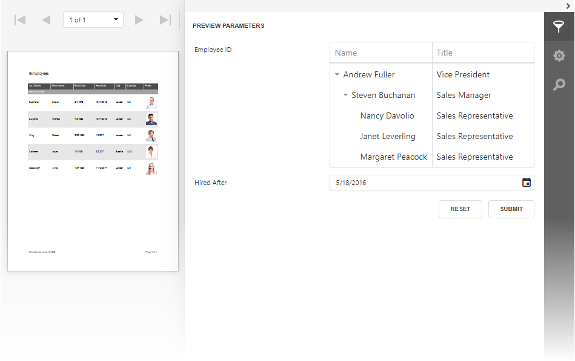

# Customized Parameter Editor in Web Reporting Controls (ASP.NET MVC)

This example demonstrates how to customize a standard parameter editor and add a custom editor for a standard parameter type. 

## Files to look at

- [HomeController.cs](CS/ParameterEditorAspNetMvcExample/Controllers/HomeController.cs) (VB:[HomeController.vb](VB/ParameterEditorAspNetMvcExample/Controllers/HomeController.vb))
- [Viewer.cshtml](CS/ParameterEditorAspNetMvcExample/Views/Home/Viewer.cshtml) (VB: [Viewer.vbhtml](VB/ParameterEditorAspNetMvcExample/Views/Home/Viewer.vbhtml))
- [Designer.cshtml](CS/ParameterEditorAspNetMvcExample/Views/Home/Viewer.cshtml) (VB: [Designer.vbhtml](VB/ParameterEditorAspNetMvcExample/Views/Home/Viewer.vbhtml))

